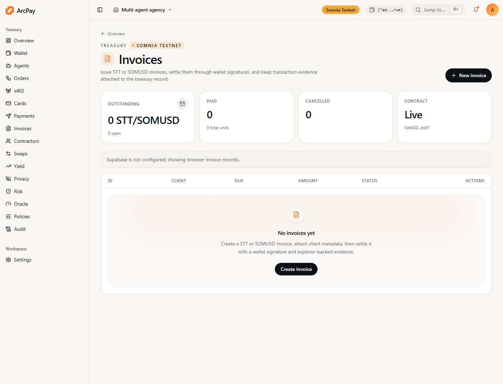

ArcPay invoices give agent businesses a normal client billing workflow while keeping settlement evidence on Somnia.

## Supported Tokens

- `STT`
- `SOMUSD`

## Flow

1. Operator creates invoice metadata in the ArcPay workspace.
2. App derives `invoiceId = keccak256(publicInvoiceId)`.
3. Operator calls `AgentInvoiceBook.createInvoice`.
4. Payer signs `payNativeInvoice` for STT or approves SOMUSD then calls `payTokenInvoice`.
5. Operator can sync status from Somnia and export audit evidence.

## Contract

```text
AgentInvoiceBook: 0x643De19f32B1d0c396Cf8B5cD677549c442Fbbf7
SOMUSD: 0x02b8316775057e2096471473663d51ceafbe3e3b
```

## CLI

```bash
npm run arcpay -- invoice-id inv_001
npm run arcpay -- invoice-guide
```

## Product Screen


