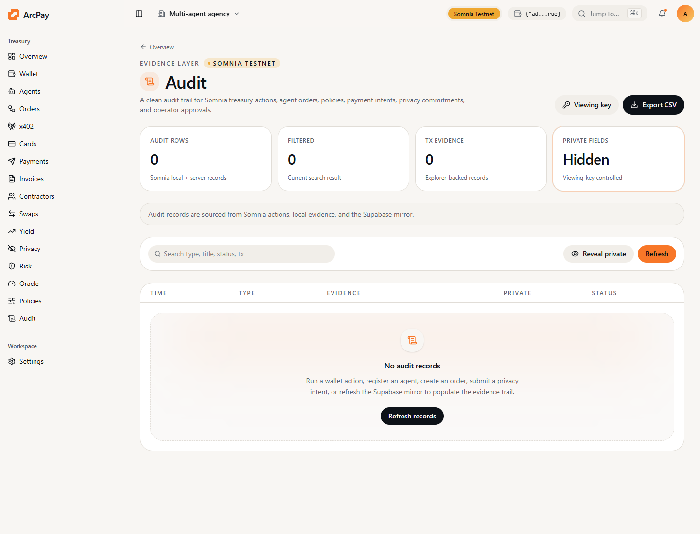

Use this page to verify that the app, docs, x402 backend, developer API, and Somnia contracts are live.

## Public Endpoints

| Surface | URL |
| --- | --- |
| App | `https://arcpay-somnia.vercel.app` |
| Docs | `https://csi-58c5959c.mintlify.app` |
| App docs path | `https://arcpay-somnia.vercel.app/docs` |
| OpenAPI | `https://arcpay-somnia.vercel.app/openapi.json` |
| Agent context | `https://arcpay-somnia.vercel.app/llms.txt` |
| HTTP developer tools | `https://arcpay-somnia.vercel.app/api/developer/tools` |
| x402 health | `https://x402.20.208.46.195.nip.io/health` |
| x402 demo | `https://x402.20.208.46.195.nip.io/x402/demo` |

## Curl Checks

```bash
curl https://arcpay-somnia.vercel.app/openapi.json
curl https://arcpay-somnia.vercel.app/llms.txt
curl https://arcpay-somnia.vercel.app/api/developer/tools
curl https://arcpay-somnia.vercel.app/api/developer/tools/derive_agent_id?slug=research-agent
curl https://x402.20.208.46.195.nip.io/health
curl https://x402.20.208.46.195.nip.io/x402/payment-requirements/research-agent
```

## Local Checks

```bash
npm run docs:check
npm run build:frontend
npm test
npm run check:worker
npm run check:x402
npm run smoke:auth
npm run smoke:live
npm run smoke:x402
```

`smoke:live` requires a funded Somnia Testnet wallet. It writes small live transactions to validate registry, policy, orders, cards, privacy intents, invoices, and risk oracle flow.

## Contract Proofs

All deployed contract addresses are listed in `somnia-contracts`. Each address links to the Somnia Testnet explorer from the app's public docs page and from the product `/proofs` page.

## Audit Screen


