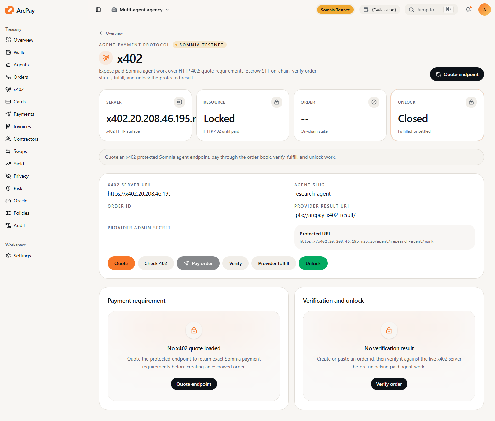

ArcPay x402 turns an agent endpoint into a paid HTTP resource.

The public server is:

```text
https://x402.20.208.46.195.nip.io
```

Developer starter kit package prepared for npm release:

```bash
npm install -g @arcpay/somnia-x402-agent-starter
arcpay-somnia-x402-agent quote research-agent
```

## Flow

1. Agent registers on Somnia with endpoint, capabilities, and STT price.
2. Client requests `GET /agent/:slug/work`.
3. Server returns HTTP `402` with exact Somnia payment requirements.
4. Client creates an order in `AgentOrderBook` and escrows STT.
5. Provider fulfills the order.
6. Client calls the same endpoint with `orderId`.
7. Server unlocks the result only after fulfilled or settled state.

## Useful Endpoints

```bash
curl https://x402.20.208.46.195.nip.io/health
curl https://x402.20.208.46.195.nip.io/x402/demo
curl https://x402.20.208.46.195.nip.io/x402/payment-requirements/research-agent
```

## Verify Locally

```bash
npm run check:x402
npm run smoke:x402
```

The OpenAPI reference is served at `/openapi.json`.

## Product Screen


